# Blood Oxygen and Heart Rate Monitoring System

Design of a simple device for measuring heart rate and blood oxygen saturation (SpO₂) using a dedicated sensor, with live results displayed on an OLED screen. The device also signals when critical values are exceeded via an LED or an audible buzzer.

---

## Table of Contents

- [1  Project Plan](#1project-plan)
  - [1.1  Project Components](#11project-components)
- [2  Bill of Materials](#2bill-of-materials)
- [3  Operating Principle](#3operating-principle)
- [4  Schematics](#4schematics)
  - [4.1  Electrical Schematic (Fritzing)](#41electrical-schematic-fritzing)
  - [4.2  Wiring Diagram (KiCad)](#42wiring-diagram-kicad)
- [5 Project Implementation](#5-project-implementation)
  - [5.1 Stage 1 – Breadboard](#51-stage-1--breadboard)
  - [5.1 Stage 2 – Enclosure Modelling](#51-stage-2--enclosure-modelling)
  - [5.1 Stage 3 – Printing the Enclosure](#51-stage-3--printing-the-enclosure)
  - [5.1 Stage 4 – Assembling the Electronics](#51-stage-4--assembling-the-electronics)
  - [5.2 Software Implementation](#52software-implementation)
- [6 Summary](#6-summary)
- [7 Project Results](#7-project-results)
  - [7.1 Device Overview](#71-device-overview)
  - [7.2 Errors Encountered](#72-errors-encountered)
  - [7.3 Future Improvements](#73-future-improvements)


## 1  Project Plan

### 1.1  Project Components

1. **Microcontroller** (e.g., ESP32, Arduino Nano) – manages the project logic, communicates with the sensor and the display.
<p align="center">
  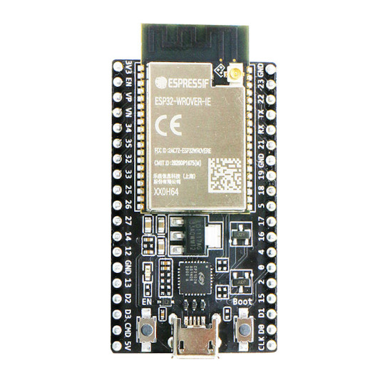
</p>

2. **Pulse‑oximetry sensor** (MAX30100 or MAX30102) – measures heart rate and blood oxygen saturation. The user places a finger on this compact module.
<p align="center">
  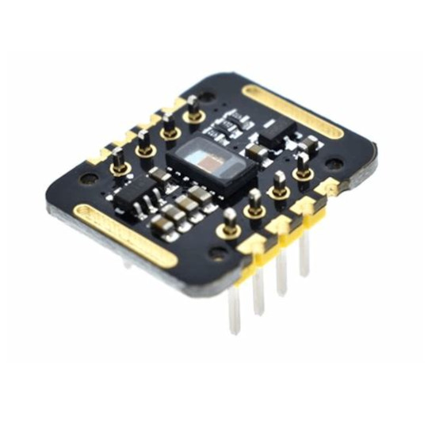
</p>

3. **OLED display** (128 × 64 or similar, I²C/SPI) – shows the measurement results (pulse and SpO₂).
<p align="center">
  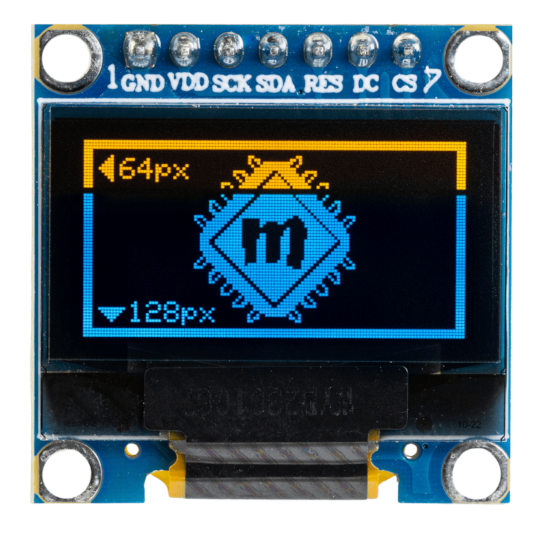
</p>

4. **Wires and breadboard / prototype PCB** – used to interconnect the components and build the circuit.
<p align="center">
  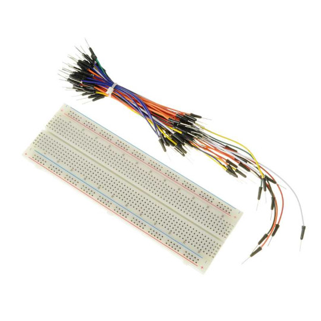
</p>

---

## 2  Bill of Materials

| Component                   | cost ($)           | 
| --------------------------- | -----------------: | 
| Microcontroller (ESP32)     |              ≈ 3.65|              
| MAX30102 sensor             |              ≈ 1.5 |                         
| OLED display                |               ≈ 2  |              
| LEDs / buzzer               |               ≈ 5  |              
| Wires and prototyping board |               ≈ 4  |              
| Solder flux                 |                  — |               
| PETG filament for enclosure |                  — |              
| **Total**                   |        **≈ 16.15** |     


---

## 3  Operating Principle

1. **Measurement** – The user places a finger on the MAX30100/30102 module, which uses red and infrared light to detect variations in blood flow and oxygen saturatio.
2. **Data processing** – The ESP32 microcontroller reads raw values over the I²C bus, filters them, and calculates the current heart rate and SpO₂. 
3. **Live display** – Results are refreshed on the OLED screen in real time, e.g., *Pulse: 75 bpm  SpO₂: 98 %*. 
4. **Alarms** – If oxygen saturation drops below a safe threshold (≈ 90 %), the red LED flashes or the buzzer beeps to alert the user. 

---

## 4  Schematics

### 4.1  Electrical Schematic (Fritzing)

The breadboard‑level circuit diagram created in Fritzing shows how the sensor, display, LEDs and buzzer connect to the ESP32’s power rails and GPIO pins. 
<p align="center">
  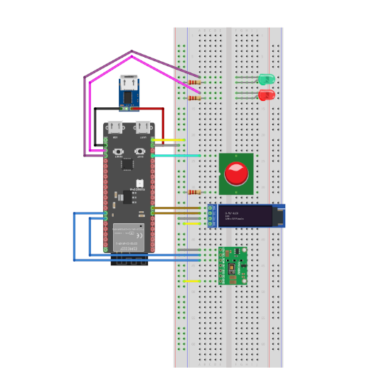
</p>

<p align="center">
  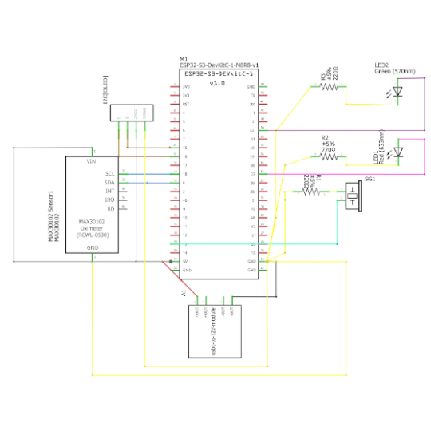
</p>

### 4.2  Wiring Diagram (KiCad)
<p align="center">
  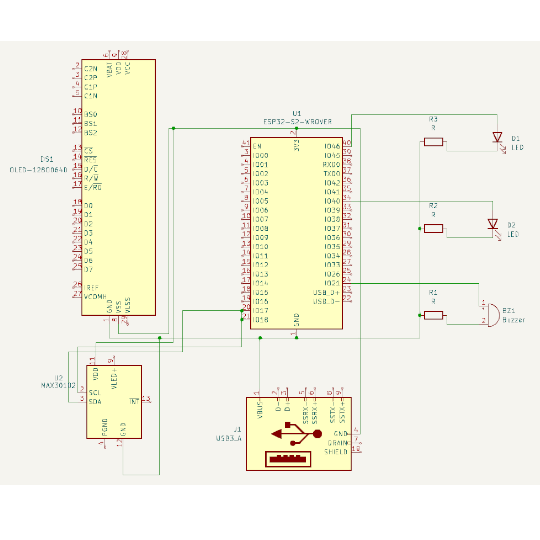
</p>

---

## 5 Project Implementation

### 5.1 Stage 1 – Breadboard

<p align="center">
  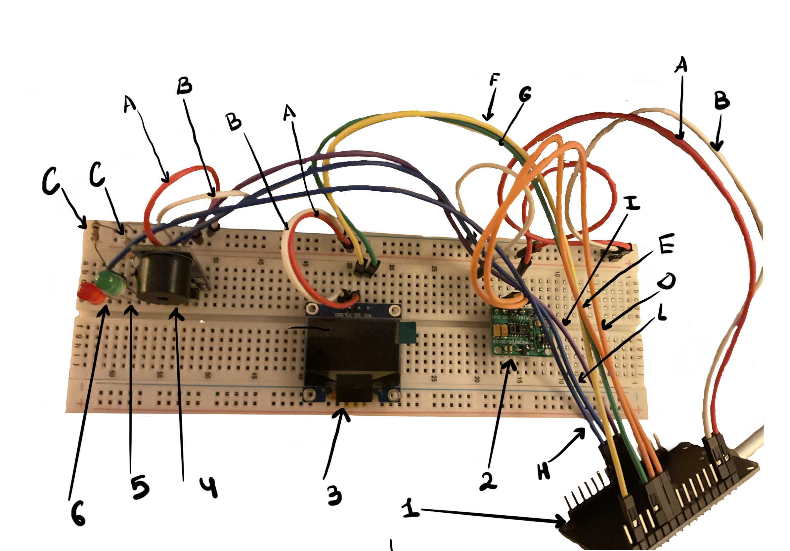
</p>


The prototype was first built on a breadboard to verify all connections and ensure each part worked as intended. The setup included:

1. **ESP32 microcontroller** — receives sensor data and displays results  
2. **MAX30100 sensor** — initial module for heart-rate and blood-oxygen (SpO₂) measurement  
3. **OLED display (I²C)** — shows measurement results  
4. **Buzzer** — alarm signal  
5. **Green LED**  
6. **Red LED**

**Connections**

A. `ESP32 (3V3)` → `MAX30102 (VIN)`, `Buzzer (VCC)`, `OLED (VCC)`  
B. `ESP32 (GND)` → `MAX30102 (GND)`, `OLED (GND)`  
C. `ESP32 (GND)` → LED cathodes (via resistors)  
D. `ESP32 (D21)` → `MAX30102 (SDA)`  
E. `ESP32 (D22)` → `MAX30102 (SCL)`  
F. `ESP32 (D4)`  → `OLED (SDA)`  
G. `ESP32 (D5)`  → `OLED (SCL)`  
H. `ESP32 (D25)` → Red-LED anode  
I. `ESP32 (D27)` → Buzzer signal  
J. `ESP32 (D26)` → Green-LED anode  

---

### 5.1 Stage 2 – Enclosure Modelling

<p align="center">
  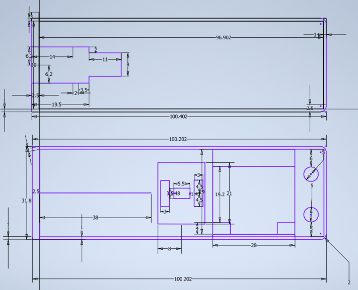
</p> 


The flat sketch details all dimensions and mounting-hole positions for the ESP32, MAX30102, OLED display, and LEDs/buzzer. Seven design-print cycles were needed to correct misaligned holes and mismatched dimensions.


<p align="center">
  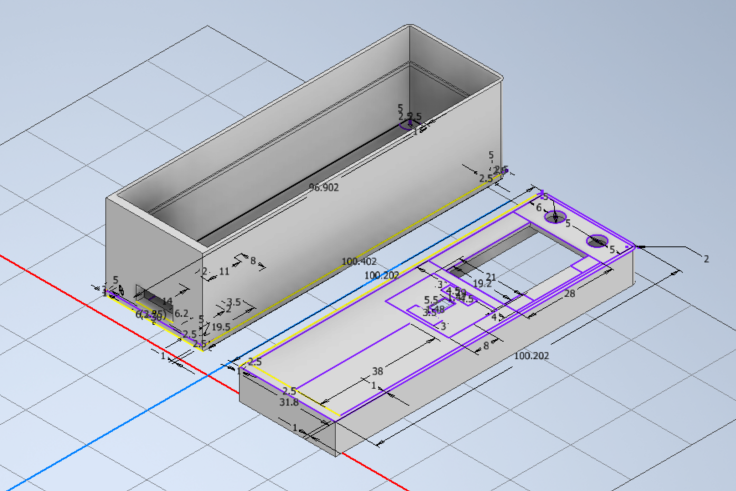
</p> 


Body height was optimised to minimise PETG use while maintaining rigidity.

---

### 5.1 Stage 3 – Printing the Enclosure


Printed on a **Creality K1 Max** with white PETG.

**Print parameters**

- Filament: PETG, Ø 1.75 mm, white  
- Bed temp: 80 °C  Nozzle temp: 235 °C  
- Layer height: 0.20 mm Print speed: 150 mm/s  
- Infill: 20 % honeycomb Walls: 3  
- Cooling: from layer 3 Supports: *touching buildplate*

**Result**

≈ 2 h print time. The enclosure was defect-free; white PETG gave a clean matte finish.  


---

### 5.1 Stage 4 – Assembling the Electronics


<p align="center">
  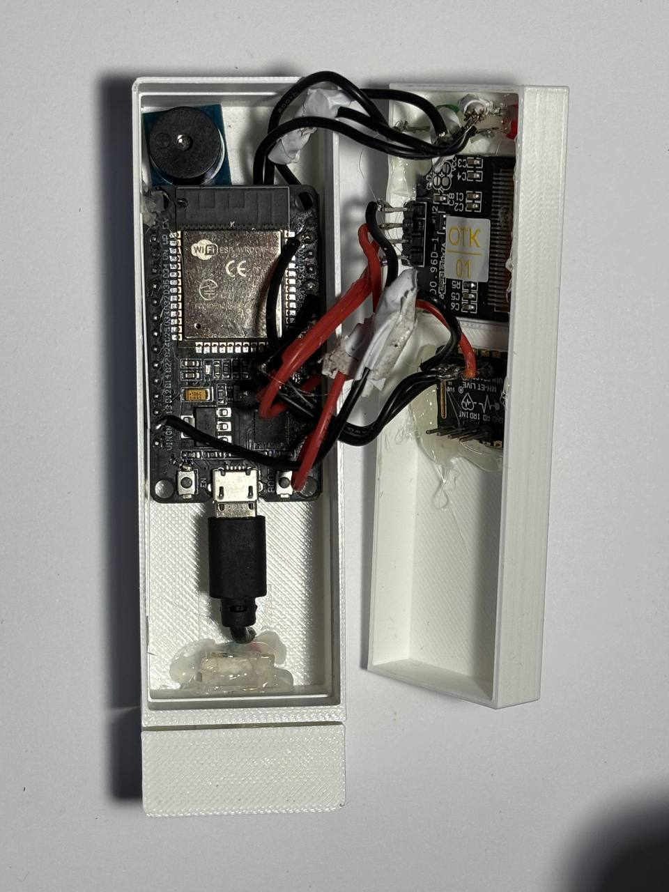
</p>  

The circuit was transferred to the new housing, using freshly cut leads for neat solder joints.

- **Lower section:** Components placed and fixed with minimal hot-glue for easy maintenance.  
- **Upper lid:** Remaining parts glued to prevent movement.  
- **Power:** Shortened micro-USB → USB cable, hot-glued for strain relief.  ---


### 5.2 Software Implementation

**Introduction**

For serial communication with the **ESP32** board I use the **picocom** tool, which provides easy access to the serial port.

## Required MicroPython libraries

This project relies on two external modules that are **not** included in the
standard firmware:

- `micropython-ssd1306` – OLED driver  
- `micropython-max30102` – MAX30102 pulse-oximeter driver

### Quick install (board has Wi-Fi)

```bash
# Install MicroPython’s package manager if missing
pip install mip  # or 'upip', depending on your firmware

# Grab the libraries
mip install micropython-ssd1306
mip install micropython-max30102
```
[main.py](./main.py)


## 6 Summary

The entire system now works as intended: data are displayed on the OLED, the LEDs indicate status, and short audible alerts are triggered without interruptions.  
Keep in mind, however, that the **MAX30102** cannot match professional-grade accuracy. It measures red- and infrared-light reflectance, so skin thickness, blood-flow changes, or an imperfect finger position can cause noticeable reading fluctuations.

In the firmware I tuned several sensor parameters—for example, changing the LED amplitude  
`sensor.set_active_leds_amplitude(0x2F)`  
and the sample rate  
`sensor.set_sample_rate(200)`.  
These tweaks better align the sensor’s sensitivity with the test conditions but cannot fully eliminate noise. In practice, treat the readings as indicative values or for trend monitoring only.

From a software standpoint the solution already detects finger presence, reads pulse, estimates SpO₂, and presents the data clearly on the OLED. Further signal-filtering algorithms could improve stability and reliability. Nevertheless, the current implementation fulfils the core goals and provides a basis for more advanced experiments.

---

## 7 Project Results

### 7.1 Device Overview

The finished pulse- and oxygen-measurement device performed correctly in all tests.  
It comprises an ESP32, a MAX30102 sensor, an OLED display, and LED/buzzer indicators.  
Data are processed in real time and shown clearly on the OLED, but—because of the MAX30102’s limitations—accuracy is below medical-device standards.

<p align="center">
  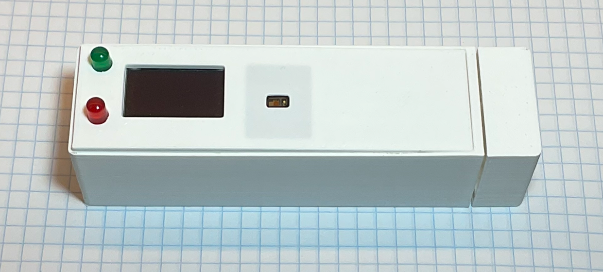
</p>  

---

### 7.2 Errors Encountered

1. **Power-cable choice** – The cable used supported only power, not data, which blocked the planned WebUSB feature for online read-outs and logging.  
2. **Enclosure design mistakes** – Inexperience produced six design errors, forcing seven print attempts. The final case still has a slight bulge caused by internal cable pressure (Figure 7-2).

<p align="center">
  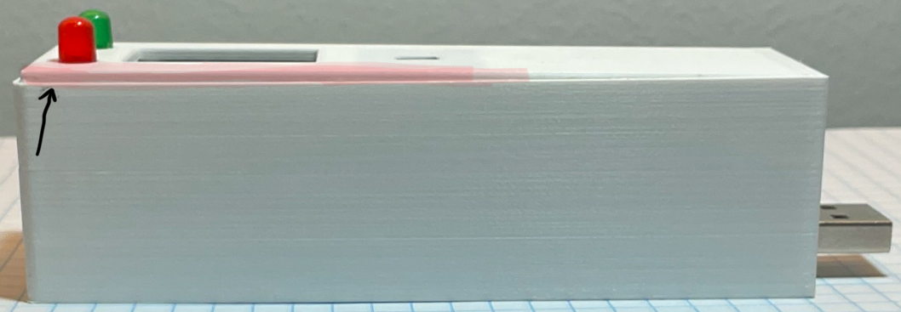
</p> 

---

### 7.3 Future Improvements

- Fix the issues above—especially selecting a cable that also carries data, enabling WebUSB functionality.  
- Shrink the enclosure by optimising component layout and removing unused space .
<p align="center">
  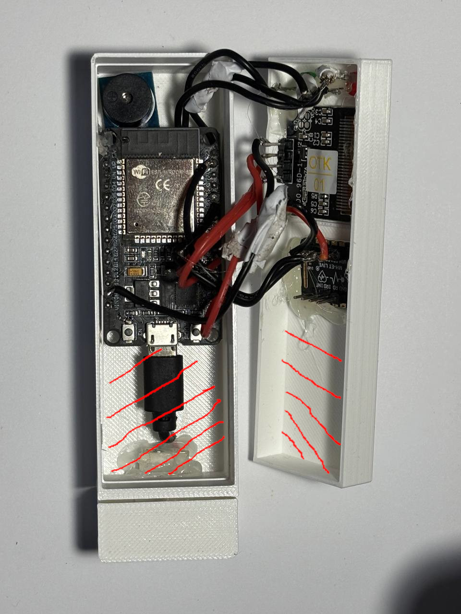
</p>

- Replace the ESP32 with a more compact microcontroller, allowing battery power.  
- Enhance signal-processing algorithms to increase measurement stability and accuracy.


